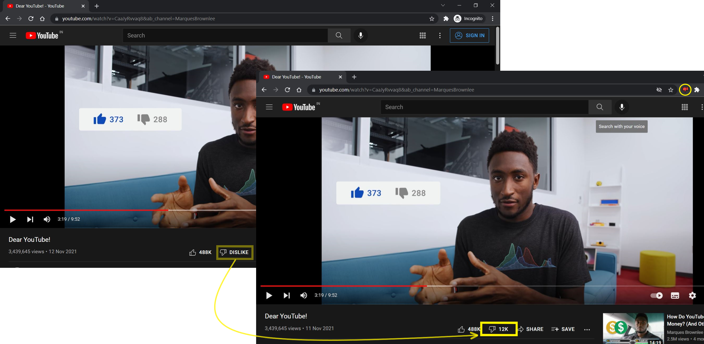

# Youtube Dislike Count
A Chrome extension that adds the dislikes:thumbsdown: count back to your [YouTube](https://www.youtube.com/).
> This extension uses YouTube Data API to get the dislikes count.

## Note
> As of Nov 10, 2021, YouTube made the dislikes count private across the complete platform. You can read more about it [here](https://blog.youtube/news-and-events/update-to-youtube/).
